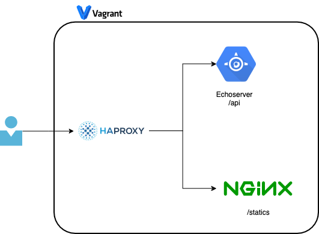

# API Proxy Deployment with Vagrant, Ansible, and Docker

This is a simple approach on how to proxy different services on the same instance using Ansible.



The main goal is to provide the necessary code to deploy a Proof of Concept (PoC) infrastructure capable of supporting a web application development lifecycle. The project uses Ansible to deploy a PoC on Docker with a Load Balancer that routes traffic to different backends based on specific patterns:
  - We will use HAProxy as a load balancer
  - /api requests will be simulated with EchoServer
  - /statics requests will be served by Nginx

## How to run the code

### Run Vagrant

Running the Vagrant file also executes the Ansible playbook, as the Ansible provisioner is configured to do so.
```
# Ansible provisioner
master.vm.provision "ansible" do |ansible|
  ansible.playbook = "api-proxy.yml"
  ansible.inventory_path = "inventory/hosts"
```

To run Vagrant you need:
1. Be in the same location as the Vagrant file
2. Run `vagrant up`

### Run Ansible playbook autonomously

Running the ansible playbook stand alone is really easy, you only need to use the **-i** to include the inventory and the playbook by itself.

> ansible-playbook -i inventory/hosts api-proxy.yml

### Manage multiple installations

If you want to install multiple nginx and echoserver instances you will need to modify the api-proxy.yml file.

1. Find the **api-proxy.yml**
2. Locate the **vars** section
3. Modify them as necessary

**vars section**
```
vars:
  echoserver: 2
  nginx: 2
```

#### Sample Run

This is a sample run of the Ansible playbook.

```
/usr/local/Cellar/ansible/10.1.0/libexec/lib/python3.12/site-packages/paramiko/pkey.py:100: CryptographyDeprecationWarning: TripleDES has been moved to cryptography.hazmat.decrepit.ciphers.algorithms.TripleDES and will be removed from this module in 48.0.0.
  "cipher": algorithms.TripleDES,
/usr/local/Cellar/ansible/10.1.0/libexec/lib/python3.12/site-packages/paramiko/transport.py:259: CryptographyDeprecationWarning: TripleDES has been moved to cryptography.hazmat.decrepit.ciphers.algorithms.TripleDES and will be removed from this module in 48.0.0.
  "class": algorithms.TripleDES,

PLAY [cluster] **********************************************************************************************************************************************************************************

TASK [Gathering Facts] **************************************************************************************************************************************************************************
[WARNING]: Platform linux on host master is using the discovered Python interpreter at /usr/bin/python3.10, but future installation of another Python interpreter could change the meaning of
that path. See https://docs.ansible.com/ansible-core/2.17/reference_appendices/interpreter_discovery.html for more information.
ok: [master]

TASK [Install docker and dependecies] ***********************************************************************************************************************************************************
included: docker for master

TASK [docker : Updating the system] *************************************************************************************************************************************************************
ok: [master]

TASK [docker : Upgrading the system] ************************************************************************************************************************************************************
ok: [master]

TASK [docker : Installing aptitude using apt] ***************************************************************************************************************************************************
ok: [master]

TASK [docker : Installing required system packages] *********************************************************************************************************************************************
ok: [master] => (item=apt-transport-https)
ok: [master] => (item=ca-certificates)
ok: [master] => (item=curl)
ok: [master] => (item=software-properties-common)
ok: [master] => (item=python3-pip)
ok: [master] => (item=virtualenv)
ok: [master] => (item=python3-setuptools)
ok: [master] => (item=python3-apt)

TASK [docker : Adding Docker GPG apt Key] *******************************************************************************************************************************************************
ok: [master]

TASK [docker : Adding Docker Repository] ********************************************************************************************************************************************************
ok: [master]

TASK [docker : Updating apt and installing docker-ce] *******************************************************************************************************************************************
ok: [master]

TASK [docker : Install Docker CLI] **************************************************************************************************************************************************************
ok: [master]

TASK [docker : Copying Daemon File] *************************************************************************************************************************************************************
ok: [master]

TASK [docker : Restarting Docker Service] *******************************************************************************************************************************************************
changed: [master]

TASK [docker : Adding vagrant user to docker] ***************************************************************************************************************************************************
ok: [master]

TASK [Deploy Nginx instances] *******************************************************************************************************************************************************************
included: nginx for master
included: nginx for master => (item=1)

TASK [nginx : Deploy Nginx instance 0] **********************************************************************************************************************************************************
ok: [master] => {
    "msg": "Deploying Nginx instance 0"
}

TASK [nginx : Pull nginx Docker image] **********************************************************************************************************************************************************
ok: [master]

TASK [nginx : Create directory for site content] ************************************************************************************************************************************************
ok: [master]

TASK [nginx : Copying Index File] ***************************************************************************************************************************************************************
changed: [master]

TASK [nginx : Copying Nginx Configuration] ******************************************************************************************************************************************************
changed: [master]

TASK [nginx : Replace server number on index] ***************************************************************************************************************************************************
changed: [master]

TASK [nginx : Replace server number on conf] ****************************************************************************************************************************************************
changed: [master]

TASK [nginx : Run nginx Docker container] *******************************************************************************************************************************************************
changed: [master]

TASK [Deploy echoserver instances] **************************************************************************************************************************************************************
included: echoserver for master
included: echoserver for master => (item=1)

TASK [echoserver : Deploy Echoserver instance 0] ************************************************************************************************************************************************
ok: [master] => {
    "msg": "Deploying Echoserver instance 0"
}

TASK [echoserver : Pull echoserver image] *******************************************************************************************************************************************************
ok: [master]

TASK [echoserver : Run echoserver container] ****************************************************************************************************************************************************
changed: [master]

TASK [Deploy haproxy instances] *****************************************************************************************************************************************************************
included: haproxy for master

TASK [haproxy : Deploy HAProxy Server] **********************************************************************************************************************************************************
ok: [master] => {
    "msg": "Deploying HAProxy Server"
}

TASK [haproxy : Pull haproxy Docker image] ******************************************************************************************************************************************************
ok: [master]

TASK [haproxy : Copying haproxy Configuration] **************************************************************************************************************************************************
changed: [master]

TASK [haproxy : Add nginx servers to haproxy.cfg] ***********************************************************************************************************************************************
included: /Users/danielbianco/Documents/api-proxy/roles/haproxy/tasks/backend_config.yml for master
included: /Users/{user}/Documents/api-proxy/roles/haproxy/tasks/backend_config.yml for master => (item=1)

TASK [haproxy : Print iteration number] *********************************************************************************************************************************************************
ok: [master] => {
    "msg": "Modifiying configuration for nginx-0"
}

TASK [haproxy : Get infos on container nginx-0] *************************************************************************************************************************************************
ok: [master]

TASK [haproxy : Replace server number on index] *************************************************************************************************************************************************
changed: [master]

TASK [haproxy : Add echoserver servers to haproxy.cfg] ******************************************************************************************************************************************
included: /Users/{user}/Documents/api-proxy/roles/haproxy/tasks/backend_config.yml for master
included: /Users/{user}/Documents/api-proxy/roles/haproxy/tasks/backend_config.yml for master => (item=1)

TASK [haproxy : Print iteration number] *********************************************************************************************************************************************************
ok: [master] => {
    "msg": "Modifiying configuration for echoserver-0"
}

TASK [haproxy : Get infos on container echoserver-0] ********************************************************************************************************************************************
ok: [master]

TASK [haproxy : Replace server number on index] *************************************************************************************************************************************************
changed: [master]

TASK [haproxy : Run haproxy Docker container] ***************************************************************************************************************************************************
changed: [master]

PLAY RECAP **************************************************************************************************************************************************************************************
master                     : ok=60   changed=19   unreachable=0    failed=0    skipped=0    rescued=0    ignored=0  
```

## Considerations

You will need the following
1. [Vagrant](https://www.vagrantup.com/)
2. [VirtualBox](https://www.virtualbox.org/)
3. [Ansible](https://www.ansible.com/)

## Bibliography:
- [How To Setup Vagrant and Virtual Box for Ubuntu 20.04!!](https://medium.com/devops-dudes/how-to-setup-vagrant-and-virtual-box-for-ubuntu-20-04-7374bf9cc3fa)
- [Provisioning machines locally with Ansible and Vagrant](https://stribny.name/blog/provisioning-ansible-vagrant/)
- [Run Haproxy With Docker](https://www.haproxy.com/blog/how-to-run-haproxy-with-docker#run-haproxy-with-docker)
- [A Guide to Ansible with Vagrant](https://medium.com/@alokkavilkar/a-guide-to-ansible-with-vagrant-6fccf9c49591)

**TODO**:
[ ] Use handlers
[ ] Check if its possible to use Jinja to do the replacements